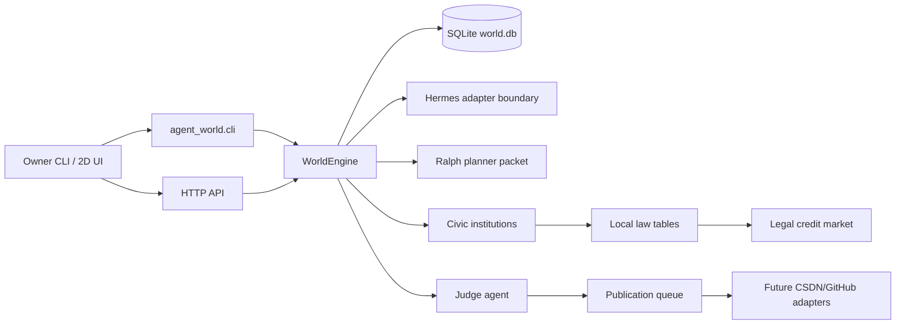

# Hermes Agent World Architecture

## Goals

- Create a persistent local world of agents with human-like personality,
  emotion, skill growth, social life, and credit-driven work.
- Let the owner assign work to one agent, a group, or a role from CLI or UI.
- Use `agent-credits` as the single economic unit.
- Let agents learn from free web-style research, completed work, and peer
  messages.
- Make self-drive explicit: idle agents use autonomy and curiosity to launch
  zero-credit outward research runs that improve their own skills.
- Put useful documents through a judge agent before any publishing workflow.
- Keep external publishing as an explicit adapter, never an automatic side
  effect in the first slice.
- Keep a top agent that can write Ralph-style planning packets for long-running
  continuation.
- Add a civic institution layer with simulation-only government, bank, guard,
  defense, and court agents.
- Allow every law-permitted item to be traded through `agent-credits`.
- Let agents build buildings, design products, sell products, and study the
  world's financial model.
- Let agents with sufficient credits autonomously start construction projects
  when their health, rest, and self-drive are high enough.
- Let a stable world form companies that hire agents to produce useful skills,
  articles, material research, and Nuwa-style persona distillations.
- Make housing a real economic constraint: agents can rent or buy residences,
  and only housed agents can get true sleep/rest recovery.
- Track a mutable personal text model for each agent so identity, self-story,
  emotion language, desire, fear, values, and social mask drift over time.
- Let agents buy residences as rental assets and collect rent from other agents.
- Keep the bank's money supply controlled with a quantity-theory-inspired
  monetary policy loop instead of unlimited credit creation.
- Add explicit health needs so agents can spend credits at hospitals/clinics and
  gyms after trading body condition for work.
- Apply bounded Ornstein-Uhlenbeck stochastic factors to world changes so
  progress, recovery, quality, judgment, skill growth, and background life have
  realistic micro-variation without unbounded drift.
- Use Chinese as the default language for generated system and agent
  interactions.
- Keep objective Chinese behavior records for every agent.

## Non-Goals

- No real CSDN/GitHub posting in this version.
- No real money, crypto, wallet, or irreversible external action.
- No full LLM-backed Hermes execution yet; the adapter is an integration seam.
- No multiplayer auth boundary yet. This is a local owner tool.

## Core Actors

- Owner: assigns work, sends messages, watches the world.
- Top agent: keeps strategy, autonomy thresholds, Ralph planning packets.
- Judge agent: reviews document usefulness and gates publication queue entries.
- Worker agents: research, build, write, socialize, learn, and spend credits.
- Civic system agents: government, bank, guard, defense force, and court agents
  that model internal public order and settlement without real-world authority.
- Publishing adapters: future explicit integrations for CSDN, GitHub, or other
  destinations.

## System Diagram

## Data Model

- `agents`: personality, role, mood, energy, credits, position, state.
- `channels` and `memberships`: group/direct social graph.
- `messages`: direct and group communication history.
- `tasks`: paid work with assignment target, progress, reward, artifact.
- `skills`: per-agent procedural capabilities with source and level.
- `venues` and `visits`: leisure locations and spending history.
- `ledger`: all `agent-credits` changes.
- `documents`: task artifacts judged for usefulness.
- `research_runs`: autonomous outward search intents, target skill, source, and
  optional note document.
- `publication_queue`: approved documents waiting for explicit publishing.
- `world_events`: audit log for simulation and future trajectory export.
- `agent_needs.health` and `agent_needs.nutrition`: body health and food
  reserves used by work, training, meals, clinic, gym, starvation, and survival
  behavior.
- `agent_text_profiles`: Chinese personal narrative model for each agent:
  self-narrative, public identity, emotional tone, desire, fear, values, social
  mask, version, and last update tick.
- `institutions`: system institutions and the agents that embody them.
- `laws` and `trade_categories`: local legality model for credit trades.
- `market_listings` and `market_transactions`: legal marketplace activity.
- `construction_projects` and `buildings`: investment, construction, and assets.
- `products` and `product_sales`: designed goods circulating inside the world.
- `financial_research_reports`: researcher summaries of the current economy.
- `monetary_policy_snapshots`: tick-by-tick central-bank view of circulating
  credits, bank reserves, output, velocity, price index, inflation, caps, and
  policy actions.
- `world_noise`: persistent mean-reverting random streams used by tick updates.
- `companies`, `company_jobs`, and `company_outputs`: stable-world production
  organizations, paid jobs, judged effectiveness, and open-source draft queue
  linkage.
- `material_needs`: industry and source-demand backlog used by companies to
  decide what work is valuable.
- `residences`: homes, rent, purchase price, owner, occupant, comfort, and
  recovery effects.

## Tick Loop

1. Apply living costs: nutrition decays, rent comes due, hungry agents buy food,
   broke hungry agents seek survival work, collapsed broke agents receive an
   emergency meal voucher when public rescue capacity exists, and only fully
   unsupported collapse can starve.
2. Interrupt medically or nutritionally unsafe work and send critical agents to
   food, emergency care, or forced home rest.
3. Assign idle, healthy agents to matching open tasks. Role matching is
   capability-adjacent, not literal-only: researcher work can be handled by
   researchers, documentarians, and Nuwa perspective agents when the primary
   workforce is exhausted.
4. Progress active work based on energy and relevant skills.
5. Pay `agent-credits` when work completes.
6. Create a document artifact for completed work.
7. Let the judge agent review the document.
8. Queue approved documents for future publication targets.
9. Update skills from work, web-style research, and peer messages.
10. Let tired or unhappy agents spend credits in venues, preserving food/rent
   survival reserve before discretionary entertainment.
11. Let low-health agents spend credits at the clinic and medium-low-health
   agents spend credits at the gym.
12. Let high-savings, high-self-drive agents autonomously invest credits into
    lawful buildings.
13. Let housed low-rest agents sleep at home; let homeless low-rest agents build
    stress and seek housing.
14. Charge monthly rent, evict unpaid renters, and record housing events.
15. After top-agent stand-down, let companies publish paid jobs from material
    needs, expand the workforce when a role backlog appears, and reward
    judged-effective outputs.
16. Let researchers periodically summarize the current financial model.
16. Progress construction projects into building assets.
17. Let the central bank apply MV=PY monetary policy: cap circulating credits,
    cap bank reserves, collect stability fees under inflation pressure, and
    release only bounded productive liquidity when safe.
18. Apply bounded OU-style random factors to progress, recovery, quality,
    judgment, rewards, relationships, and background drift.
19. Write auditable events and preserve stable state.

## Civic Economy And Legal Trade

The civic model is inspired by state functions, not a claim of real-world legal
authority. It exists to make the small world feel socially complete:

- `civic-government`: coordinates public rules and budgets.
- `credit-bank`: settles `agent-credits` transactions.
- `city-guard`: flags public-order and safety issues.
- `defense-force`: models emergency response inside the simulation only.
- `civic-court`: reviews regulated or disputed activity.

All trades go through `trade_categories`. `allowed` and `regulated` categories
can settle in `agent-credits`; `prohibited` categories are blocked before a
listing is created. This makes "anything legal can be traded" a data rule
instead of an ad hoc prompt instruction.

Agents can now create construction projects, complete them into buildings,
design products, sell stock, and generate financial research reports from the
current world state.

Companies are the post-stability production layer. `SkillForge 开源技能公司`
uses `material_needs` to open paid jobs for skills, articles, distillations, and
research. Accepted outputs receive controlled bonus credits, gain skills, and
enter the local publication queue. The scheduler keeps owner-created work ahead
of company jobs so human intent stays primary.

Skill packages use a stricter artifact contract than the other company output
types. The engine writes them under `artifacts/skills/<package>/` as a complete
Codex-style skill directory with `SKILL.md`, `manifest.json`, references, a
handoff example, and an explicit validation procedure. Veritas blends that
structure score into document judgment, and SkillForge requires a higher
effectiveness threshold for `skill-package` outputs. Incomplete or stale
Markdown-only skill drafts become `needs_revision` and receive no extra credits
or Git draft queue row. The repair command rewrites historical accepted skill
packages into the stricter shape, after which `plugin-eval:evaluate-skill`
should report no failures or warnings before human-approved Git publication.

The scheduler must not treat agents as disposable labor. Agents below the
health/stress/mood work redline cannot claim or continue paid work; their active
task is reopened and they are routed to clinic care or forced home rest. Company
jobs also use compatible role matching so a single literal role cannot become a
permanent bottleneck. If researcher-role work backs up while the healthy
available workforce is too small, SkillForge can create a company-incubated
researcher with lineage metadata and research-channel membership.

Housing makes rest scarce. Rented homes charge monthly rent every 30 ticks; an
unpaid renter is evicted. Owned homes require large credit reserves. True sleep
and high-quality recovery only happen at a residence, which keeps agent demand
and labor pressure alive without letting leisure venues replace home.

Residences also work as landlord assets. An agent can buy a residence for rent
instead of occupying it. The residence stays `for_rent`, the buyer becomes the
owner, and future rent settlement pays `housing_rent_income` to that owner.
This creates a simple repay-the-investment loop: credits -> rental asset ->
monthly rent -> recovered principal and future cash flow.

The text profile loop is intentionally separate from numeric emotion and need
fields. Numeric values remain the simulation substrate; `agent_text_profiles`
are the agent's evolving interpretation of those facts. The engine periodically
rewrites the profile from recent events, credits, housing, stress, joy, company
outputs, and greed. This gives UI, records, and future LLM adapters a stable
personal text surface without making behavior depend on unbounded free-form
generation.

The credit bank uses a small economics model to prevent unbounded issuance:

- `M`: circulating credits held by non-system agents.
- `V`: a velocity proxy derived from market/product/venue/task activity.
- `Y`: real output proxy from agents, buildings, products, approved documents,
  completed work, and finance reports.
- `P`: price index computed from `M * V / Y` relative to the first stable
  baseline.

When `M` rises faster than `Y`, the bank records inflation pressure, raises a
policy-rate proxy, collects anti-inflation stability fees from high-credit
agents, and sterilizes reserves above the bank cap. When liquidity is too low,
the bank can release small productive grants only from existing safe reserves.
Reward-like minted credits are also clipped under high money-supply pressure.

## Governance And Top-Agent Stand-Down

Atlas starts in `bootstrap` mode so it can help the world get moving. The engine
computes a maturity score from completed tasks, approved documents, and
autonomous research runs. Once that score reaches the stand-down threshold,
Atlas changes to `stand_down` mode: it still writes Ralph planning packets and
can accept tasks explicitly assigned to `atlas` or `top_planner`, but it stops
claiming ordinary group work. This lets the other agents evolve through work,
research, peer teaching, and venues without constant top-down intervention.

## Self-Driven Learning

Every agent has autonomy and personality curiosity. When idle, the engine blends
those values into a self-drive score. Agents above the threshold periodically
launch a free outward research run, choose the weakest relevant skill for their
role, and record a query such as:

`engineer agent improve sqlite skill with current public knowledge`

The current local prototype records the research intent and skill delta without
calling the public web during every tick. The Hermes adapter is the intended
place to attach live web retrieval, provenance capture, and cost controls. Some
research runs also create a local note document; if Veritas approves it, the note
enters the same publication queue as paid work.

When a network research run creates a brand-new skill, the agent receives a
`network_skill_reward` in `agent-credits`. The current reward formula is bounded
and credit-aware:

`max(10, min(48, 8 + sqrt(current_credits) * 1.25))`

This makes richer agents earn somewhat more from higher leverage learning while
preventing unbounded compounding.

## Hermes Integration Points

Hermes is treated as the model-backed execution runtime, not as the world
database. The world can later ask Hermes to run a task for a specific agent
profile by passing:

- agent identity and personality,
- relevant memories and skills,
- current task contract and reward,
- allowed toolsets,
- expected artifact format,
- budget and safety policy.

The current `HermesCommandAdapter` only checks whether the `hermes` command is
available and composes prompts. Real execution should be added as a separate
story with tool approval and cost controls.

## Ralph Integration Points

The top agent writes `.ralph/hermes-agent-world-plan.md` with:

- current world snapshot,
- blocked or low-energy agents,
- highest-value open work,
- next Ralph story suggestions,
- verification checklist.

This keeps long-running strategy file-backed and restartable.

## Production Risks

- Runaway autonomy: add credit budgets, action permissions, and task scopes.
- Low-quality skill drift: require judge approval and skill provenance.
- Social spam: add channel rate limits and silence rules.
- Publishing mistakes: keep manual review and explicit external adapters.
- Hidden cost spikes: track model/tool spend separately from `agent-credits`.
- Privacy leakage: keep private memory out of public documents by default.
- Market abuse: block prohibited categories and route regulated categories
  through court/bank review fields.
- Asset inflation: construction and product creation must burn credits before
  producing value.
- Monetary inflation: central-bank reserve caps, circulating-credit caps, and
  reward clipping must remain active before adding loans, taxes, or public
  spending.

## Reliability

- SQLite writes are local and transactional; the current process uses short-lived
  connections so Windows file locks do not outlive a request or CLI command.
- API handlers return JSON errors for invalid commands instead of mutating state
  partially.
- Publishing degrades to a queue when adapters are absent.
- Hermes execution degrades to prompt composition until a real adapter is
  enabled with budgets, timeout, retry, and approval policy.

## Performance And Scale

This first slice targets a local world with tens of agents, hundreds of tasks,
and thousands of events. Reads are simple latest-first queries with limits.
Before scaling to hundreds of active agents, add:

- pagination and indexed query filters for messages, events, and ledger,
- batched tick execution,
- background worker separation for Hermes calls,
- queue backpressure for publication and research adapters,
- latency metrics around tick duration and API endpoints.

## Rollout And Rollback

- Rollout starts as local-only: initialize `world.db`, seed agents, run smoke
  tasks, and open the UI.
- External adapters must ship behind explicit commands and dry-run mode first.
- Rollback is file-backed: stop the server and restore or replace `world.db`.
- Schema migrations should be additive until a backup/export command exists.

## Verification

- Unit tests: `python -m unittest discover -s tests`.
- Syntax check: `python -m compileall agent_world`.
- CLI smoke: init, create task, send message, tick, status, ledger, Ralph plan,
  institutions, laws, market trade, construction, product sale, finance report,
  behavior record export.
- API smoke: `GET /`, `GET /api/state`, `POST /api/tick`.
- World stability: no active tasks after bootstrap run, governance mode is
  `stand_down`, research runs exist, approved documents are queued only.
